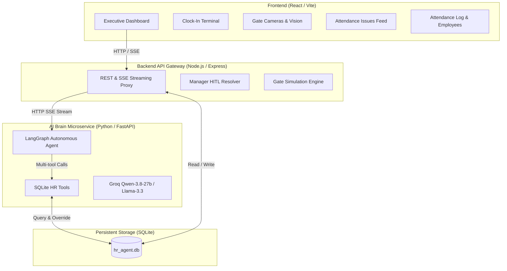
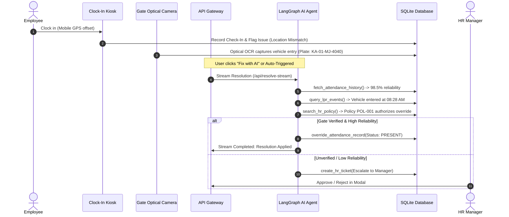

# 🧠 Autonomous HR AI Agent & Workforce Intelligence

[](https://github.com/)
[](https://github.com/)
[](https://console.groq.com/)
[](https://nodejs.org/)
[-003B57?style=flat-square)](https://www.sqlite.org/)
[](https://react.dev/)

An enterprise-grade, autonomous Human Resources AI Agent that handles workforce attendance discrepancies, verifies physical presence using Optical License Plate Recognition (LPR) gate cameras and GPS telemetry, cross-references corporate policies, and autonomously resolves attendance records in SQLite.

---

## 🌟 Key Highlights

- 🤖 **Autonomous Agentic Reasoning:** Powered by **LangGraph**, the agent doesn't just read data — it invokes multi-step SQLite tools, reviews GPS logs, cross-checks optical vehicle cameras, queries policy rulebooks, and writes database overrides.
- 📹 **Live Gate Camera & Optical OCR Vision:** Simulates CCTV perimeter gate cameras and optical License Plate Recognition (LPR) sensors to verify physical campus arrivals.
- ⚡ **Real-Time Streaming Thought Process:** Watch the AI agent stream its multi-step investigation live via Server-Sent Events (SSE) into an intuitive step-by-step modal.
- 🛡️ **Human-in-the-Loop (HITL) Governance:** High-risk anomalies or unexcused policy exceptions automatically escalate to a dedicated manager review modal with complete evidence attached.
- 🗄️ **Persistent SQLite Database:** Unified single-source-of-truth database in Write-Ahead-Logging (WAL) mode shared seamlessly across Python AI tools, Node.js API Gateway, and the React UI.
- 🎨 **Clean Enterprise UI:** Modern, uncluttered executive interface with a left sidebar layout, restrained colors, and progressive disclosure modals.

---

## 🏗️ System Architecture



### Microservices Breakdown:
1. **`ai-service/` (Python / FastAPI / LangGraph):**
   - Implements the agent state graph and autonomous decision engine.
   - Contains SQLite-backed tools (`fetch_attendance_history`, `check_geofence_logs`, `query_lpr_events`, `search_hr_policy`, `override_attendance_record`, `create_hr_ticket`).
   - Streams live thoughts and tool invocations via SSE (`/api/anomalies/resolve-stream`).
2. **`backend/` (Node.js / Express / better-sqlite3):**
   - API Gateway providing REST endpoints for employees, attendance logs, gate telemetry, and policy management.
   - Manages Human-in-the-Loop (HITL) manager approvals and SSE streaming pass-through.
3. **`frontend/` (React / Vite / Lucide Icons):**
   - Clean enterprise dashboard with Left Sidebar navigation.
   - Attendance Issues dispatch, Clock-In Kiosk simulation, Live Gate Vision feed, and Detailed Evidence modals.
4. **`data/hr_agent.db` (SQLite):**
   - Unified database storing employees, gate logs, geofence logs, attendance records, policies, and audit trails.

---

## 🚀 Quick Start Guide

### Prerequisites
- **Node.js** (v18 or higher)
- **Python** (3.10 or higher)
- **Groq API Key** (Free from [console.groq.com](https://console.groq.com))

---

### Step 1: Configure & Start the Python AI Service

```bash
# Navigate to the AI service directory
cd ai-service

# Install dependencies
pip install -r requirements.txt

# Create environment file from template
cp .env.example .env
```

Edit `ai-service/.env` and add your Groq API Key:
```env
GROQ_API_KEY=gsk_your_groq_api_key_here
LLM_MODEL=qwen/qwen3.8-27b
HOST=0.0.0.0
PORT=8000
```

Start the FastAPI server:
```bash
python main.py
# AI service runs at http://localhost:8000
```

---

### Step 2: Configure & Start the Node.js API Gateway

Open a **second terminal**:

```bash
# Navigate to the backend directory
cd backend

# Install dependencies
npm install

# Start the server (auto-seeds SQLite on first launch)
node server.js
# API Gateway runs at http://localhost:5000
```

---

### Step 3: Start the React Frontend

Open a **third terminal**:

```bash
# Navigate to the frontend directory
cd frontend

# Install dependencies
npm install

# Start the Vite development server
npm run dev
# Frontend runs at http://localhost:5173
```

Open **`http://localhost:5173`** in your browser.

---

## 💡 How the Agentic Workflow Operates



---

## 📋 Features Overview

### 1. Attendance Issues
Review all pending check-in discrepancies in real time. Click **"Fix with AI"** to start the streaming autonomous investigation, or click **"View Investigation Details"** to inspect the full reasoning, evidence logs, and policy citations in a clean modal.

### 2. Clock-In Terminal
Simulate employee check-ins across various hardware methods (Mobile Geofence, Biometrics, Badge, Web Portal) with customizable GPS offsets and gate arrival triggers.

### 3. Team & Attendance Log
Complete attendance records with search and filter capabilities. Includes an **"Add Employee"** button to register new staff, assign license plates, and set initial reliability scores.

### 4. Gate Cameras & Vision
Interactive CCTV monitor simulating optical perimeter gate cameras (*North Perimeter Gate*, *Main Parking Turnstile*, *Tech Park Gate*). Run simulated vehicle scans with real-time OCR confidence readouts.

### 5. Company Policies
Manage corporate HR attendance policies and action guidelines referenced by the AI Agent. Create custom rules via the **"Add Policy"** dialog.

### 6. Performance & Audit Trail
Executive dashboard displaying autonomous resolution rates, administrative hours saved, cost savings, and a permanent SQLite compliance audit log.

---

## 📁 Repository Structure

```
Autonomous-HR-AI-Agent/
├── ai-service/                # Python FastAPI & LangGraph AI Service
│   ├── app/
│   │   ├── core/              # Config & LLM initialization (Groq)
│   │   ├── routes/            # FastAPI anomaly & resolution endpoints
│   │   ├── schemas/           # Pydantic structured output models
│   │   ├── services/          # LangGraph state graph & streaming engine
│   │   └── tools/             # SQLite tools for the agent
│   ├── .env.example
│   ├── main.py
│   └── requirements.txt
├── backend/                   # Node.js API Gateway
│   ├── database.js            # SQLite schema, WAL configuration, & seeds
│   ├── server.js              # REST endpoints & SSE streaming proxy
│   ├── .env.example
│   └── package.json
├── frontend/                  # React.js (Vite) User Interface
│   ├── src/
│   │   ├── components/        # Modals, Feed, Kiosk, Cameras, Ledger
│   │   ├── App.jsx            # Main app shell & state manager
│   │   ├── index.css          # Clean Enterprise Light Mode styling
│   │   └── utils.js           # Label & formatting helpers
│   ├── index.html
│   └── package.json
├── data/
│   └── hr_agent.db            # Persistent SQLite database
├── .gitignore
└── README.md
```

---

## 🔒 Security & Privacy

- **Safe Defaults:** Non-destructive testing mode ensures critical edge cases are safely routed to human supervisors via Human-in-the-Loop workflows.
- **Audit Logging:** Every AI thought, policy citation, and database modification is recorded in the permanent `audit_logs` table for compliance.
- **Local SQLite:** All employee personal data, vehicle plates, and timestamps stay within your local database.

---

## 📄 License
This project is open-source and available under the [MIT License](LICENSE).
